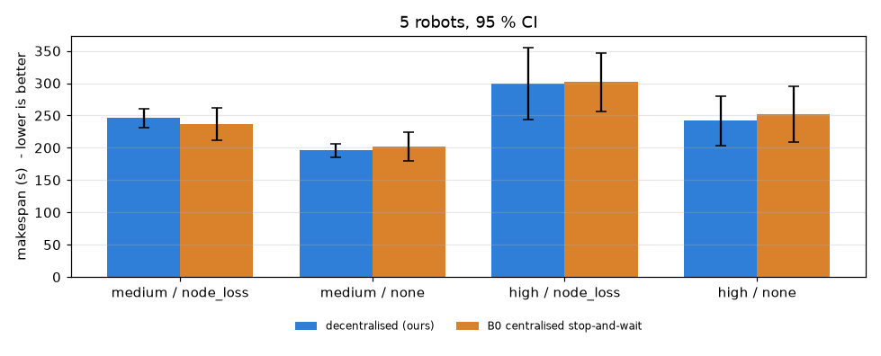
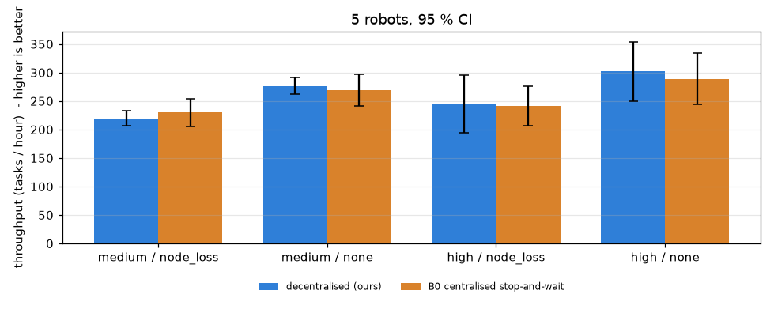

# Benchmark report — decentralised fleet vs B0 (centralised stop-and-wait)

Runs: **40** (fast runtime, identical seeds for both systems). Makespan statistics use completed runs; ± is the 95 % confidence interval (Student t). % reduction = paired per-seed (B0 − ours) / B0 over seeds where both completed; positive means our system finished sooner. Target from the problem statement: ≥ 20 %.

## Safety gates

| system | runs | all tasks done | robot–robot collisions | unresolved deadlocks | two robots in one aisle | duplicate task executions |
|---|---:|---:|---:|---:|---:|---:|
| ours | 20 | 20 | **0** | **0** | 0 | 1 |
| B0 | 20 | 20 | **0** | **0** | 0 | 3 |

## Makespan per cell

| robots | congestion | fault | ours makespan (s) | B0 makespan (s) | reduction vs B0 | ours done | B0 done |
|---:|---|---|---:|---:|---:|---:|---:|
| 5 | medium | node_loss | 246.0 ± 14.9 | 236.6 ± 25.5 | -4.3 ± 5.5 % ⚠️ below 20 % | 5/5 | 5/5 |
| 5 | medium | none | 195.8 ± 10.4 | 201.7 ± 22.3 | 2.6 ± 6.7 % ⚠️ below 20 % | 5/5 | 5/5 |
| 5 | high | node_loss | 299.7 ± 55.7 | 301.7 ± 45.6 | 0.8 ± 10.0 % ⚠️ below 20 % | 5/5 | 5/5 |
| 5 | high | none | 242.0 ± 38.4 | 252.5 ± 43.2 | 3.6 ± 13.5 % ⚠️ below 20 % | 5/5 | 5/5 |

## Other metrics per cell

| robots | congestion | fault | throughput ours / B0 (tasks/h) | mean wait at choke points ours / B0 (s) | min separation ours / B0 (m) | bytes/robot/s ours |
|---:|---|---|---:|---:|---:|---:|
| 5 | medium | node_loss | 220 ± 13 / 230 ± 25 | 1.0 ± 0.7 / 4.7 ± 1.9 | 0.80 / 0.90 | 8845 ± 205 |
| 5 | medium | none | 276 ± 15 / 269 ± 28 | 1.5 ± 0.7 / 5.0 ± 2.8 | 0.80 / 0.87 | 9205 ± 220 |
| 5 | high | node_loss | 245 ± 50 / 241 ± 35 | 1.8 ± 0.7 / 4.3 ± 2.9 | 0.73 / 0.89 | 9066 ± 246 |
| 5 | high | none | 302 ± 52 / 289 ± 45 | 2.0 ± 0.4 / 3.7 ± 2.3 | 0.80 / 0.87 | 9408 ± 159 |

## Charts

## Honest reading

- Cells meeting the ≥ 20 % makespan-reduction target: **0 of 4**.
- B0 is a strong comparator here: it shares the map traffic rules (one-way aisles), task admission control, kinematics, lidar safety and dwell times; only coordination differs (central FIFO zone reservations + stop-and-wait + central supervisor). With full knowledge and no faults, a central planner is at least as fast as a decentralised fleet, and this data shows makespans within a few percent of each other. The decentralised design's intended benefit is resilience (no single point of failure, operation through dead zones and partitions); its safety gates hold, but a makespan advantage of >= 20 % was **not** demonstrated in these cells.
- Matrix: 5 robots x congestion medium/high x faults none/node_loss x 5 seeds, for both systems on identical seeds (`python -m amr.bench.sweep`).
